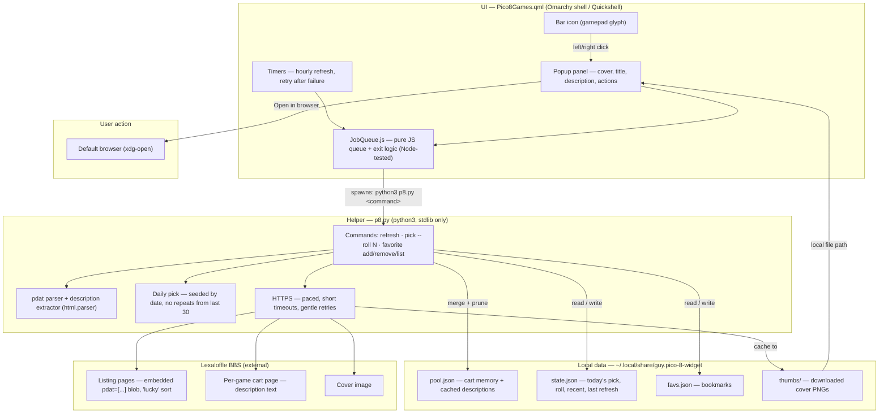
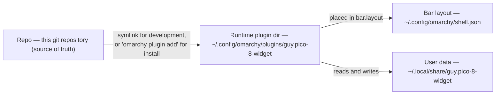
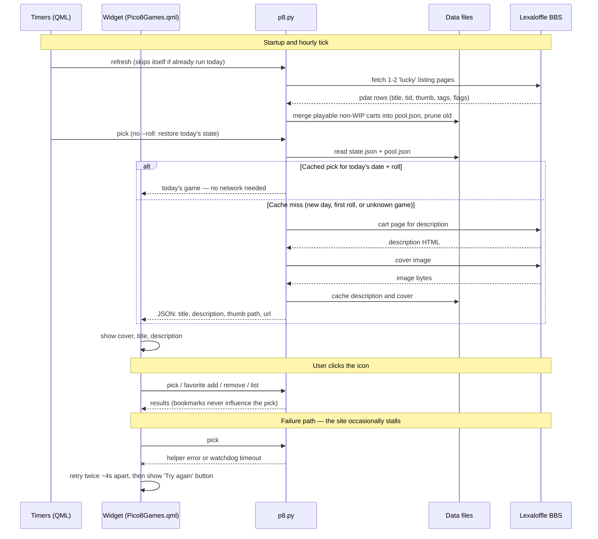
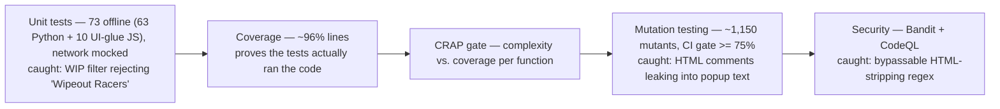

# Architecture

This file explains how the PICO-8 Widget works, in pictures. It is aimed at
people who want to understand or extend the plugin, humans and AI agents
alike.

- [1. Component map](#1-component-map)
- [2. A day in the life (sequence)](#2-a-day-in-the-life-sequence)
- [3. CI quality gates](#3-ci-quality-gates)

Quick orientation before the diagrams:

- **`Pico8Games.qml`** is the UI: the bar icon, the popup, the timers and the
  retry logic. It is Quickshell QML and can only run inside the Omarchy
  shell (a Wayland session) — which is why it is tested manually, not in CI.
- **`JobQueue.js`** is the UI's pure logic: the serialized job queue and the
  interpretation of process end-states (including the exit-0-before-output
  signal race). It has no Qt dependencies and is unit-tested in Node.
- **`p8.py`** is the stateless helper: all fetching, parsing, picking and
  bookkeeping. It is pure Python (stdlib only) and is what the CI test stack
  covers.
- **Everything persistent** lives under `~/.local/share/guy.pico-8-widget/`.

---

## 1. Component map

### Where the code lives (the three locations)

The shell only loads plugins from the runtime dir; the folder name must match
the `id` in `manifest.json`. User data lives outside the code so updates never
touch your picks and bookmarks.

---

## 2. A day in the life (sequence)

Notes: opening the game launches the default browser with the game's BBS page
via `xdg-open`. The QML layer talks to `p8.py` through a single serialized
`Process` (Quickshell can run one command at a time); the queueing and
process-end logic lives in `JobQueue.js`, so commands stay ordered and a
helper that exits 0 before its output arrives is never misreported as failed.

---

## 3. CI quality gates

Every push and pull request runs, in order, on GitHub Actions. Each layer
covers a different failure mode — and several have already caught real bugs
during development.

What is not in CI: the QML popup itself (needs a live Wayland session) and the
interaction with the real Lexaloffle site (tests mock the network; the widget
is deliberately gentle with the site — a handful of requests a day, cached
forever).
